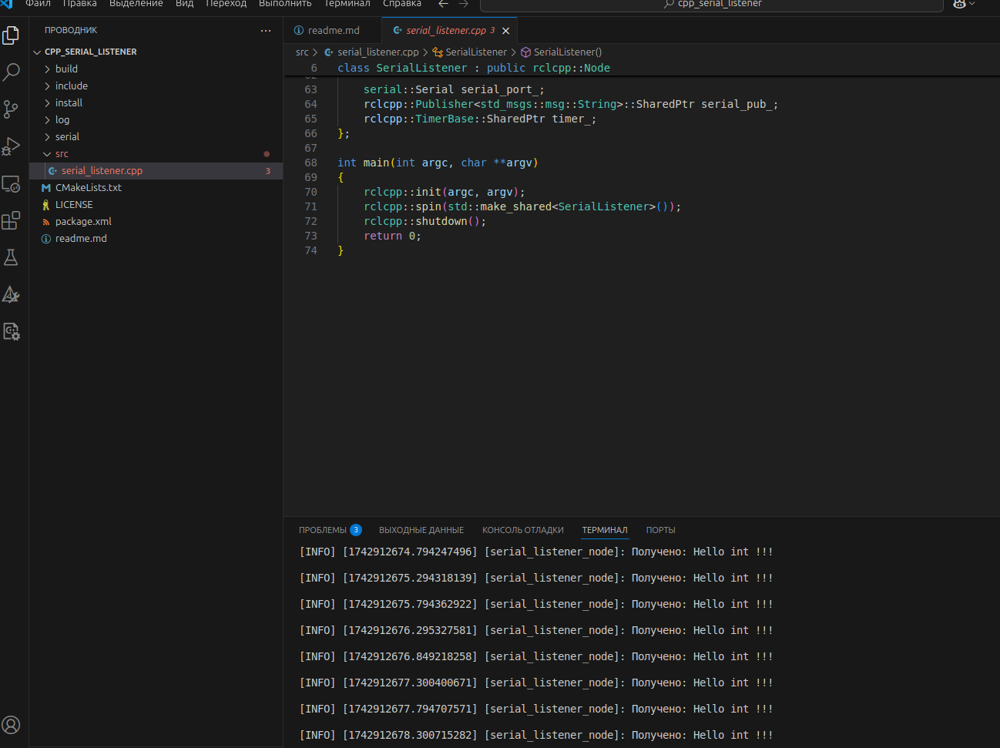

# Создание и запуск с++ com-serial монитора порта на ROS2  

### 1. перед запуском выполнить скрипт
```bash
source /opt/ros/jazzy/setup.bash
```
### 2. копируем репозиторий с подключаемой библиотекой в папку со своим проектом 
```bash
git clone https://github.com/wjwwood/serial.git
```
### 3. запускаем сборку проекта, предварительно настроив [CMakeLists.txt](CMakeLists.txt)
```bash
colcon build --packages-select serial_listener
```
### 4. подключаем источник установочных файлов
```bash
. install/setup.bash
```
### 5. запускаем проект, убедившись, что наше устройство имеет имя "ttyUSB0" (если нет - идём в [исходники](src/serial_listener.cpp) и меняем serial_port_.setPort в 17-й строчке)
sudo ./build/serial_listener/seriallistener
```
sudo chown :second_user /dev/ttyUSB0
```
## Примечание 1
### Что бы в текущей сессии работать с serial портом без sudo необходимо прописать:
```bash
sudo chown :ros-user /dev/ttyUSB0
```
#### где ros-user - пользователь
#### /dev/ttyUSB0 - порт, с которым работаем

### Что бы работать serial без sudo даже после перезагрузки необходимо прописать
```bash
sudo adduser ros-user dialout
```
### затем выйти из системы
### тогда росовские ноды с serial можно будет запускать через ros2 run:
```bash
ros2 run serial_listener seriallistener
```
### либо запустить seriallistener как обычную программу
```bash
./build/serial_listener/seriallistener
```

## Примечание 2
### Если вместо "Hello int !!!"...

### ... вы получаете следующее исключение:
```bash
IO Exception (2): No such file or directory, file /home/ros-user/ros2_jazzy/src/ros2/cpp_serial_listener/serial/src/impl/unix.cc, line 151.
```
### значит что-то не так с портом (не подключено устройство или неверное имя порта [см офф ответ](https://robotics.stackexchange.com/questions/75485/ros-serial-exception-missing-file))

### набирайте и разбирайтесь:

```bash
lsusb
sudo dmesg | grep attached
```