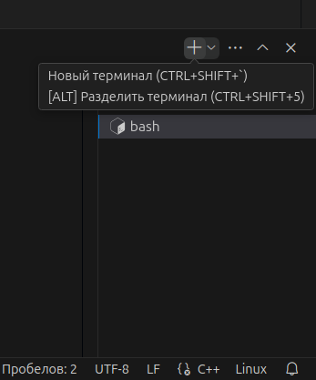

## Паральлельная отладка НОД в одной рабочей области VScode

### 1. Добавить в .vscode/launch.json ещё одну конфигурацию с новыми полями "name" и "program":
```json
{
    "version": "0.2.0",
    "configurations": [
      {
        "name": "C++ Debug talker",
        "type": "cppdbg",
        "request": "launch",
        "program": "${workspaceFolder}/build/cpp_clock/talker",
        "args": [],
        "stopAtEntry": false,
        "cwd": "${workspaceFolder}",
        "environment": [],
        "externalConsole": false,
        "MIMode": "gdb",
        "setupCommands": [
          {
            "description": "Enable pretty-printing for gdb",
            "text": "-enable-pretty-printing",
            "ignoreFailures": true
          }
        ],
        "miDebuggerPath": "/bin/gdb",
        "logging": {
          "trace": true,
          "traceResponse": true,
          "engineLogging": true
        }
      },
      {
        "name": "C++ Debug listener",
        "type": "cppdbg",
        "request": "launch",
        "program": "${workspaceFolder}/build/cpp_clock/listener",
        "args": [],
        "stopAtEntry": false,
        "cwd": "${workspaceFolder}",
        "environment": [],
        "externalConsole": false,
        "MIMode": "gdb",
        "setupCommands": [
          {
            "description": "Enable pretty-printing for gdb",
            "text": "-enable-pretty-printing",
            "ignoreFailures": true
          }
        ],
        "miDebuggerPath": "/bin/gdb",
        "logging": {
          "trace": true,
          "traceResponse": true,
          "engineLogging": true
        }
      }
    ]
  }  
```

#### Обратите внимание, что сборка проекта уже должна быть произведена если у Вас не настроена задача автоматической сборки в .vscode/tasks.json
```bash
source /opt/ros/jazzy/setup.bash
. install/setup.bash
colcon build --symlink-install --cmake-args -DCMAKE_BUILD_TYPE=RelWithDebInfo
```
#### 2. Установите точки останова в вашем коде publisher_lambda_function.cpp и в subscriber_lambda_function.cpp
#### 3. Запустите первую созданную Вами конфигурацию отладки (с вашим полем "name" напр. "C++ Debug talker"), нажав F5 или выбрав "Run and Debug" c в боковой панели

##### Обратите внимание на название терминала
#### 4. Добавьте новый терминал в VScode:

#### 5. Выполните
```bash
source /opt/ros/jazzy/setup.bash
. install/setup.bash
```
#### 6. Запустите вторую созданную Вами конфигурацию отладки (с вашим полем "name" напр. "C++ Debug listener"), нажав F5 или выбрав "Run and Debug" c в боковой панели

#### Обратите внимание на название новых терминалов
#### В панели отладки появился выпадающий список с выбором отлаживаемой программы


#### Для удобства можно разделить окно на 2 терминала с помощью drag&drop
