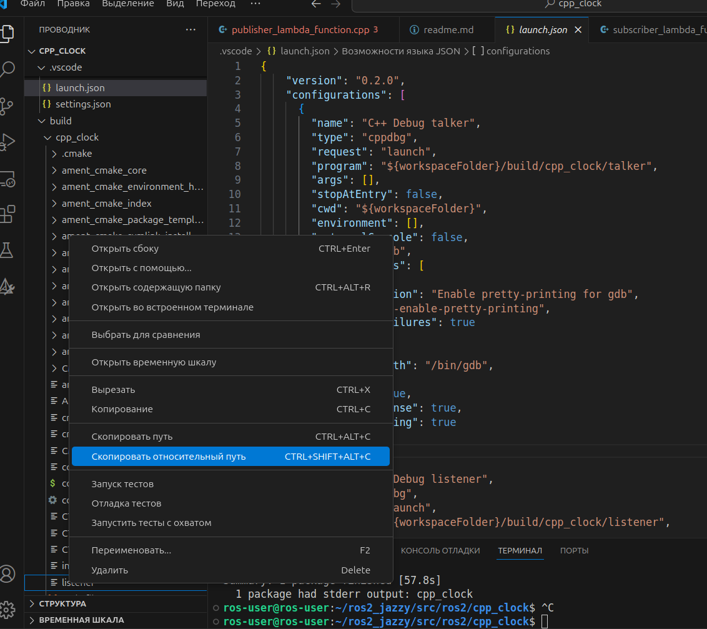
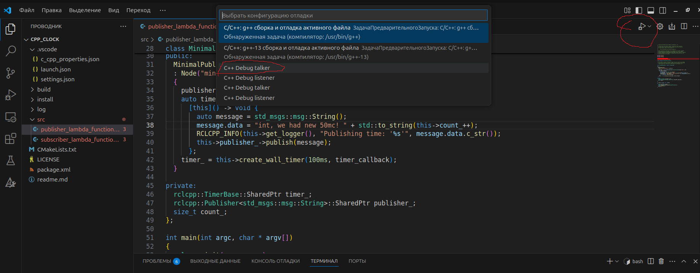

## Второй вариант отладки без gdbserver
Более простой способ отладки, но он не будет работать на железе. Преимущество - скорость, не нужен gdb server
### 1. Сборка
#### 1.1. Откройте папку вашего рабочего пространства ROS2 в VSCode.
#### 1.2. Откройте терминал в VSCode и выполните сборку рабочего пространства:
```bash
source /opt/ros/jazzy/setup.bash
. install/setup.bash
colcon build --symlink-install --cmake-args -DCMAKE_BUILD_TYPE=RelWithDebInfo
```
После успешной сборки появятся папки build, install и log
### 2. Настрока VScode
#### 2.1 Создайте файл .vscode/launch.json с следующим содержимым:
```json
{
  "version": "0.2.0",
  "configurations": [
    {
      "name": "C++ Debug listener",
      "type": "cppdbg",
      "request": "launch",
      "program": "${workspaceFolder}/build/cpp_clock/listener",
      "args": [],
      "stopAtEntry": false,
      "cwd": "${workspaceFolder}",
      "environment": [],
      "externalConsole": false,
      "MIMode": "gdb",
      "setupCommands": [
        {
          "description": "Enable pretty-printing for gdb",
          "text": "-enable-pretty-printing",
          "ignoreFailures": true
        }
      ],
      "miDebuggerPath": "/usr/bin/gdb",
      "logging": {
        "trace": true,
        "traceResponse": true,
        "engineLogging": true
      }
    }
  ]
}
```
##### В этом файле необходимо заполнить поля "program" и "name", указав путь к вашей скомпилированной программе и название конфигурации отладки


### 3. Запуск и отладка программы
#### 3.1. Установите точку останова в вашем коде publisher_lambda_function.cpp.
#### 3.2 Запустите созданную Вами конфигурацию отладки (с вашим полем "name"), нажав F5 или выбрав "Run and Debug" c в боковой панели VSCode.

### 4. Автоматическая сборка перед запуском отладки
##### Если необходимо каждый раз при  запуске отладке запускать сборку проекта, можно добавить соответствующую задачу в .vscode/tasks.json
#### 4.1 Создайте файл .vscode/tasks.json для автоматической сборки перед запуском отладки:
```json
{
  "version": "2.0.0",
  "tasks": [
    {
      "label": "build",
      "type": "shell",
      "command": "colcon build --symlink-install --cmake-args -DCMAKE_BUILD_TYPE=RelWithDebInfo",
      "args": [],
      "group": {
        "kind": "build",
        "isDefault": true
      },
      "problemMatcher": [],
      "detail": "Build the ROS2 workspace"
    }
  ]
}
```
#### 4.2 в .vscode/launch.json добавить поле "preLaunchTask":
```json
{
  "version": "0.2.0",
  "configurations": [
    {
      "name": "C++ Debug listener",
      "type": "cppdbg",
      "request": "launch",
      "program": "${workspaceFolder}/build/cpp_clock/listener",
      "args": [],
      "stopAtEntry": false,
      "cwd": "${workspaceFolder}",
      "environment": [],
      "externalConsole": false,
      "MIMode": "gdb",
      "setupCommands": [
        {
          "description": "Enable pretty-printing for gdb",
          "text": "-enable-pretty-printing",
          "ignoreFailures": true
        }
      ],
      "preLaunchTask": "build",
      "miDebuggerPath": "/usr/bin/gdb",
      "logging": {
        "trace": true,
        "traceResponse": true,
        "engineLogging": true
      }
    }
  ]
}
```
#### Такой проект должен получиться: [cpp_clock](/cpp_clock)