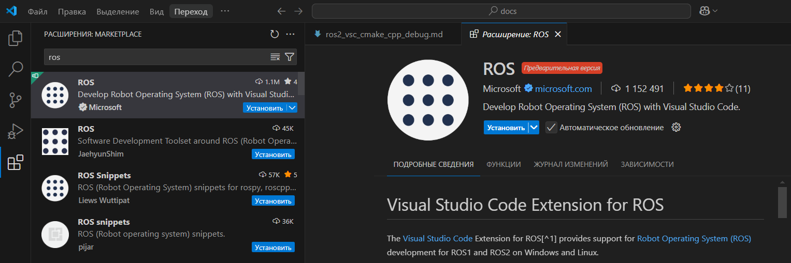

### Отлажено в окружении
- VMWareWorkstationProPlayer.v17.5.1
- [ubuntu-24.04.2-desktop-amd64](https://ubuntu.com/download/desktop/thank-you?version=24.04.2&architecture=amd64&lts=true)
- ROS2 (v: jazzy)
### на примере [Writing a simple publisher and subscriber (C++)](https://docs.ros.org/en/jazzy/Tutorials/Beginner-Client-Libraries/Writing-A-Simple-Cpp-Publisher-And-Subscriber.html)

Предварительно нужно установить:
## 1. [ROS2 (v: jazzy)](https://docs.ros.org/en/jazzy/Installation/Ubuntu-Install-Debs.html)
## 2. Установить [VScode]((https://code.visualstudio.com/))
### 1-й вариант – через встроенный магазин приложений:


### 2-й вариант – через терминал:
Откройте терминал и введите:
```bash
wget -qO- https://packages.microsoft.com/keys/microsoft.asc | gpg --dearmor > packages.microsoft.gpg
sudo install -o root -g root -m 644 packages.microsoft.gpg /usr/share/keyrings/
sudo sh -c 'echo "deb [arch=amd64 signed-by=/usr/share/keyrings/packages.microsoft.gpg] https://packages.microsoft.com/repos/vscode stable main" > /etc/apt/sources.list.d/vscode.list'
sudo apt update
sudo apt install code
```
## 3. Расширения для VScode
### C/C++

### ROS

### cmake

### Remote Development
