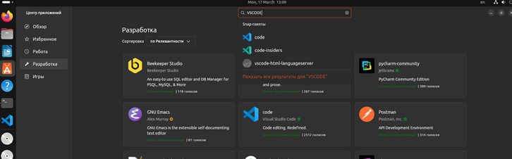

### Отлажено в окружении
- VMWareWorkstationProPlayer.v17.5.1
- [ubuntu-24.04.2-desktop-amd64](https://ubuntu.com/download/desktop/thank-you?version=24.04.2&architecture=amd64&lts=true)
- ROS2 (v: jazzy)
### на примере [Writing a simple publisher and subscriber (C++)](https://docs.ros.org/en/jazzy/Tutorials/Beginner-Client-Libraries/Writing-A-Simple-Cpp-Publisher-And-Subscriber.html)

Предварительно нужно установить:
## 1. [ROS2 (v: jazzy)](https://docs.ros.org/en/jazzy/Installation/Ubuntu-Install-Debs.html)
## 2. Установить [VScode]((https://code.visualstudio.com/))
### 1-й вариант – через встроенный магазин приложений:



### 2-й вариант – через терминал:
Откройте терминал и введите:
```bash
wget -qO- https://packages.microsoft.com/keys/microsoft.asc | gpg --dearmor > packages.microsoft.gpg
sudo install -o root -g root -m 644 packages.microsoft.gpg /usr/share/keyrings/
sudo sh -c 'echo "deb [arch=amd64 signed-by=/usr/share/keyrings/packages.microsoft.gpg] https://packages.microsoft.com/repos/vscode stable main" > /etc/apt/sources.list.d/vscode.list'
sudo apt update
sudo apt install code
```
## 3. Расширения для VScode
### C/C++

### ROS

### cmake

## 4. Настройка отладки согласно [инструкции](https://gist.github.com/JADC362/a4425c2d05cdaadaaa71b697b674425f):
### 4.1. устанавливаем [gdbserver](https://habr.com/ru/companies/rainbow/articles/251053/):
```bash
sudo apt install gdbserver
```
### Все последующие команды можно выполнять в терминале VScode:


### удаляем папки build, install и log
### 4.2. *После того, как вы правильно реализовали свой код C++ (по крайней мере, скомпилировали), первое, что нужно сделать, это скомпилировать пакет, экспортирующий символы (разрешив точки останова, где вы хотите остановить код):*
```bash
cd /home/ros-user/ros2_jazzy/src/ros2/cpp_pubsub
source /opt/ros/jazzy/setup.bash
source install/setup.bash
colcon build --symlink-install --cmake-args -DCMAKE_BUILD_TYPE=RelWithDebInfo
```
### запустить GDB Server для отладки кода CPP. Здесь мы будем использовать localhost:port для создания сервера. Выберите любой свободный порт, который вам нужен:
```bash
ros2 run --prefix 'gdbserver localhost:3000' cpp_pubsub talker
```
### создать launch.json на VSCode. Другими словами, мы создадим пользовательскую конфигурацию отладки. В нашем случае создадим клиент GDB и подключимся к серверу:
1) Откройте VSCode на рабочем столе.
2) Перейдите на боковую панель, в раздел «Запуск и отладка».
3) Добавьте новую конфигурацию (выберите среду C++ или любую другую)
4) В файле launch.json поместите следующую информацию;
```json
{
    "version": "0.2.0",
    "configurations": [
        {
            "name": "C++ Debugger",
            "request": "launch",
            "type": "cppdbg",
            "miDebuggerServerAddress": "localhost:3000",
            "cwd": "/",
            "program": "/home/ros-user/ros2_jazzy/src/ros2/cpp_pubsub/build/cpp_pubsub/talker"
        }
    ]
}
```
- name - Пользовательское имя конфигурации вашего отладчика
- request - В этом случае мы хотим запустить клиент
- type - cppdbg для отладки c++
- miDebuggerServerAddress - path_server:port
- cwd - Где найти все необходимые файлы. Мы используем root, потому что ROS, пакет и другие необходимые файлы распределены по всему ПК.
- program - Измените [build-path-executable] на ваш исполняемый файл сборки. Вы можете найти этот путь в консоли при запуске сервера.

### используйте кнопки и панели VSCode для корректной отладки кода.
[такой](cpp_pubsub) проект должен получиться. Запуск через конфигурацю "C++ Debugger"

